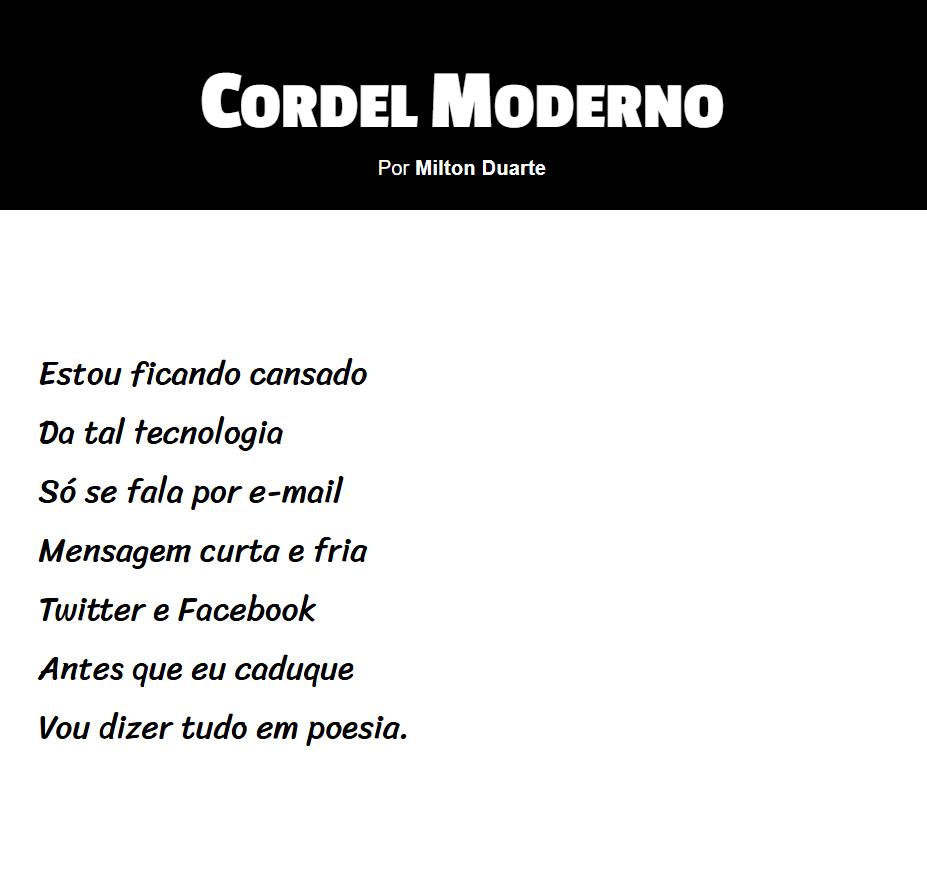

# Projeto Cordel

Projeto desenvolvido durante meus estudos de HTML5 e CSS3, com o objetivo de criar uma experiência visual moderna para a apresentação de um cordel.

O site apresenta o poema **"Cordel Moderno"**, de **Milton Duarte**, utilizando recursos de estilização avançada em CSS, como efeitos de **parallax**, tipografia personalizada e design responsivo.

## Tecnologias Utilizadas

- HTML5
- CSS3
- Google Fonts
- Versionamento com GitHub
- Código com VS Code

## Recursos Implementados

- Estrutura semântica em HTML5
- Estilização moderna com CSS3
- Efeito **Parallax** em imagens de fundo
- Design responsivo
- Utilização das fontes:
  - Passion One
  - Sriracha
- Seções alternando entre texto e imagens para melhor experiência visual

## Fonte do Conteúdo

O poema utilizado no projeto é **"Cordel Moderno"**, de <a href="https://www.recantodasletras.com.br/poesias/3186743" target="_blank" rel="external">Milton Duarte</a>.

## Demonstração

